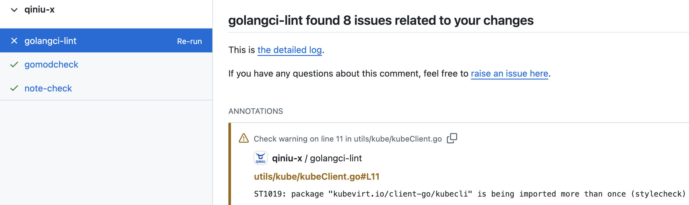
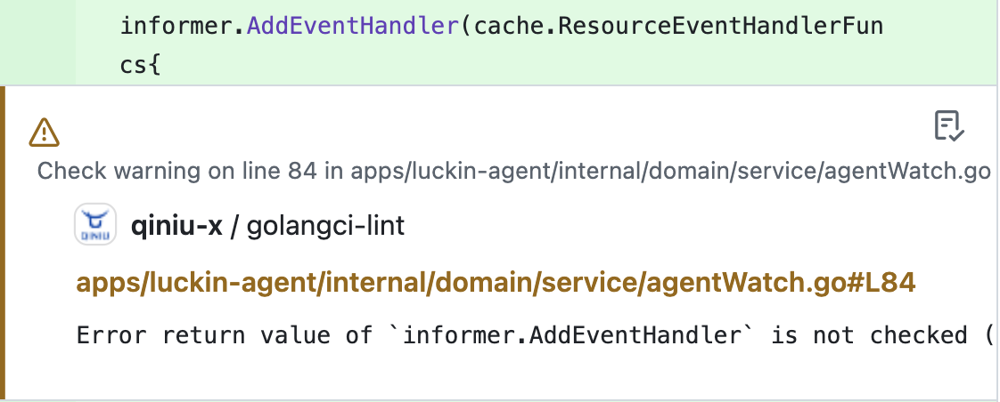
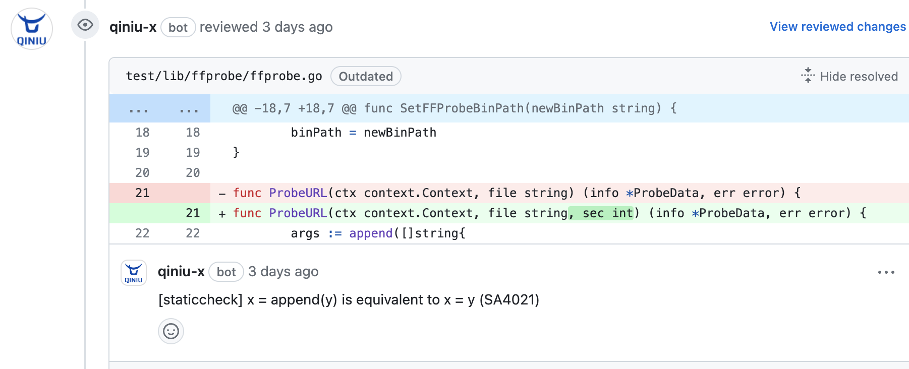
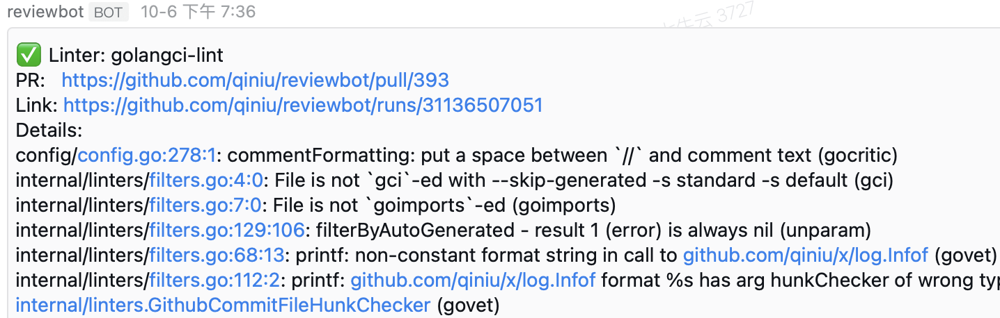
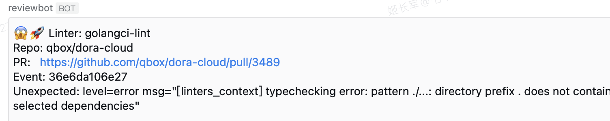

Looking to build a self-hosted code review service? Try [Reviewbot](https://github.com/qiniu/reviewbot), now open-sourced!

## When do you need a self-hosted code review service?

You might need one when:

- You have many repos but still want tight control over code quality
- Your repos are private, and commercial services seem overkill
- You want to continuously improve the process and rules, with full customization

## Benefits of a self-hosted code review service

While many linter tools and engineering practices exist, they're often underutilized:

- Powerful tools like golangci-lint (with 100+ integrated linters) are often used with default settings, ignoring most features
- Linter outputs get buried in logs, making issue-finding a chore
- Configuring CLI-based linters for multiple repos is tedious, especially for ongoing improvements
- Monitoring code quality across repos can be daunting

A self-hosted service can automate all this. As a DevOps or QA team member, you can easily centralize control, monitoring, and customization of code quality across all repos.

Enter [Reviewbot](https://github.com/qiniu/reviewbot) - your solution for self-hosted code review.

## What can Reviewbot do?

Reviewbot helps you quickly set up a self-hosted code analysis and review service, supporting multiple languages and coding standards. It's perfect for organizations with numerous private repos.

Issues are reported during Pull Requests as `Review Comments` or `Github Annotations`, pinpointing exact code lines.

- Github Check Run (Annotations)

  
  

- Github Pull Request Review Comments

  

This approach saves PR authors from sifting through lengthy logs, streamlining problem-solving.

## Reviewbot's Design Philosophy

Focused on:

- **Security** - Self-hosting for data control
- **Improvement-Oriented** - Issues reported as Review Comments or Github Annotations for easy fixes
- **Flexibility** - Multi-language support with easy tool integration
- **Observability** - Alert notifications for timely issue awareness
- **Configurable** - Customizable linter commands, parameters, and environments

Built with Golang, Reviewbot boasts simple logic and clear code for easy maintenance.

## Main Flow

Reviewbot primarily operates as a GitHub Webhook/App service, accepting GitHub Events, executing various checks, and providing precise feedback on the corresponding code if issues are detected.

```
Github Event -> Reviewbot -> Execute Linter -> Provide Feedback
```

And you can easily Add a New Linter or do Customization.

## Monitoring Detection Results

Reviewbot supports notification of detection results through WeWork (企业微信) alerts.



If unexpected output is encountered, notifications will also be sent, like this:



## More

Check out [Reviewbot](https://github.com/qiniu/reviewbot). Feel free to have a try.

Btw, this article is also published on [medium website](https://medium.com/@dacarl.ji/reviewbot-boost-your-code-quality-with-self-hosted-automated-analysis-and-review-83d8a459eb70).

Stay tuned for more updates!
