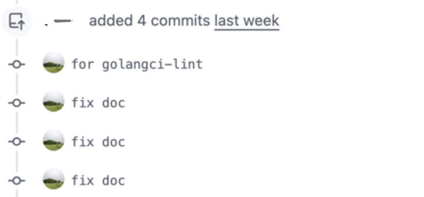
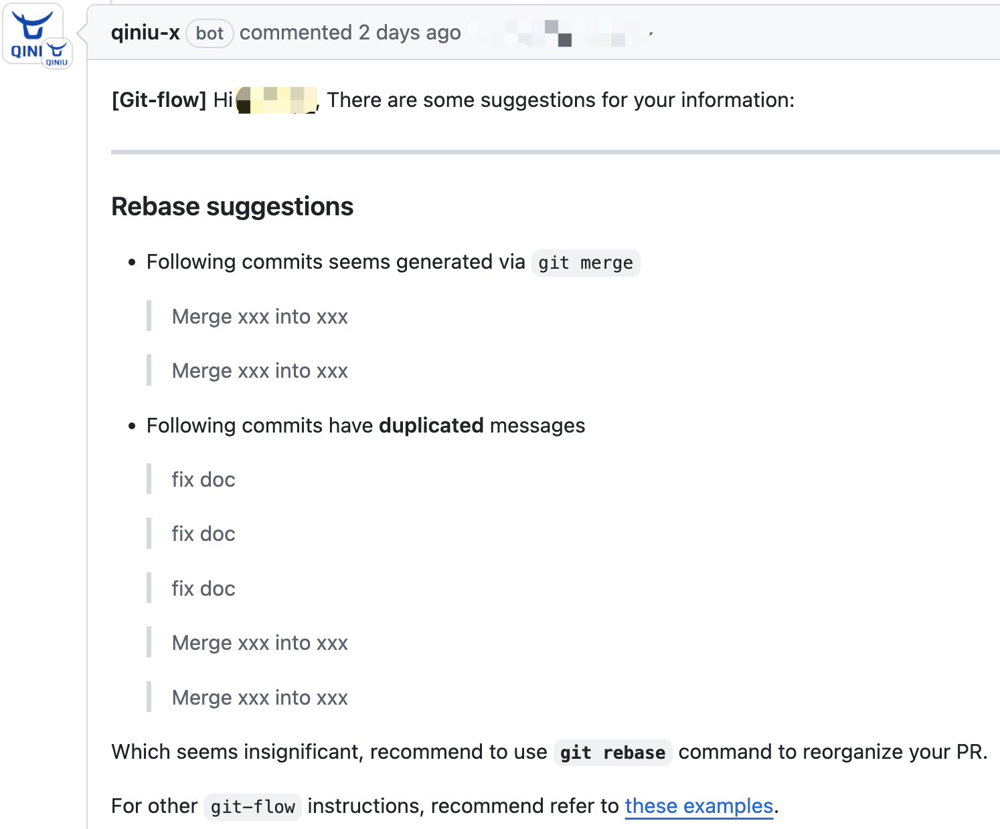

---

> [Reviewbot](https://github.com/qiniu/reviewbot) 是七牛云开源的一个项目，旨在提供一个自托管的代码审查服务, 方便做 code review/静态检查, 以及自定义工程规范的落地。

---

在日常的编程协作中，Git commit 记录的质量往往反映了一个工程师的工程素养。然而，我经常能看到一些不太规范的 commit 记录。有时，真的不敢恭维。

比如这种:



这种大概率是提交 commit 之后，又有变动，就随手重新复用上一条 git commit 命令了。

这种记录如果出现在个人仓库，可能还好. 但如果是多人协作的仓库，就有点不专业了。

在我看来，这些 commit 记录完全没必要，是非常不好的习惯，完全可以避免。

好在 Git 为我们提供了优雅的解决方案。如果没必要生成新的 commit，那直接使用 `git commit --amend` 就可以避免。


### 少用 `git merge` 多用 `git rebase`

比如这种:

```
Merge branch 'feature-A' of https://github.com/qiniu/reviewbot into feature-B
```

说的是把远程分支 feature-A 的代码合并到 feature-B 里。这里的 feature-A 通常是主分支。

这种 Commit 信息如果出现在你的 PR 里，那是完全没必要。PR 里的 commit 信息应当仅包含针对本次改动的有用信息。

我个人日常几乎不使用 `git merge`，即使是为了同步远程分支，我一般都会使用 `git rebase`。

比如:


git rebase 除了上述好处外，还可以保持主仓库的 commit history 非常干净。所以强烈推荐大家使用。

### Reviewbot 的 git commit check

为了更好的规范上述两种行为，Reviewbot 也添加了 git commit check 能力，就是用来检查 git commit 记录是否符合规范的。

如果不符合规范，Reviewbot 就会提示你:



### 更多 git flow 使用规范和技巧

当然 git 操作其实有很多实用技巧，建议大家有兴趣的话可以去研究下。我在 1024 实训营的时候，有给同学们做个相关分享:

[超实用! 从使用视角的 Git 协作实战，告别死记硬背
](https://github.com/qiniu/reviewbot/blob/master/docs/engineering-practice/git-flow-instructions_zh.md)。

文档里面有视频链接，感兴趣的同学可以去看下。

最后，作为专业的工程师，我们应该始终追求卓越的工程实践。良好的 commit 记录不仅体现了个人的专业素养，更是提升团队协作效率的重要基石。

通过合理使用 git rebase 和 git commit --amend，我们可以维护一个更清晰、更专业的代码提交历史。这不仅让代码审查变得更加轻松，也为后续的代码维护和问题追踪带来极大便利。

你觉得呢？
